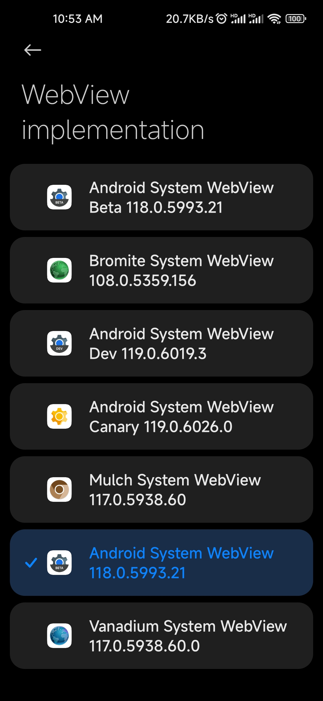

# AnyWebView

Any WebView is OK!

Android Framework should be selected in LSPosed.

A webview app must be installed for all users (or in all spaces) to be selectable. Maybe deleting redundant users is alternative.
adb command:

Enabling "[redundant packages](https://chromium.googlesource.com/chromium/src/+/HEAD/android_webview/docs/quick-start.md#valid-package-is-not-installed_enabled-for-all-users)" (Maybe it won't work, but that's OK.):

`adb shell cmd webviewupdate enable-redundant-packages`

Get USER_ID list:

`adb shell pm list users`

Each user entry is as follow: UserInfo{USER_ID:USERNAME:INT} , USER_ID 0 is the main user.

Install apk for specific USER_ID:

`adb install --user USER_ID PATH_TO_APK`

or

`adb shell pm install-existing --user USER_ID PACKAGE.NAME.OF.APK` (for apks already installed for one user)

or

`adb push PATH_TO_APK PATH_TO_APK_IN_PHONE` (copy an apk file to phone from pc)

`adb shell pm install --user USER_ID PATH_TO_APK_IN_PHONE`

Delete a user (be careful, you may lose important data):

`adb shell pm remove-user USER_ID`

All the `adb shell pm ...` commands above can be run in an Android terminal simulator(root access granted) as `pm ...`

Reboot to take effect.