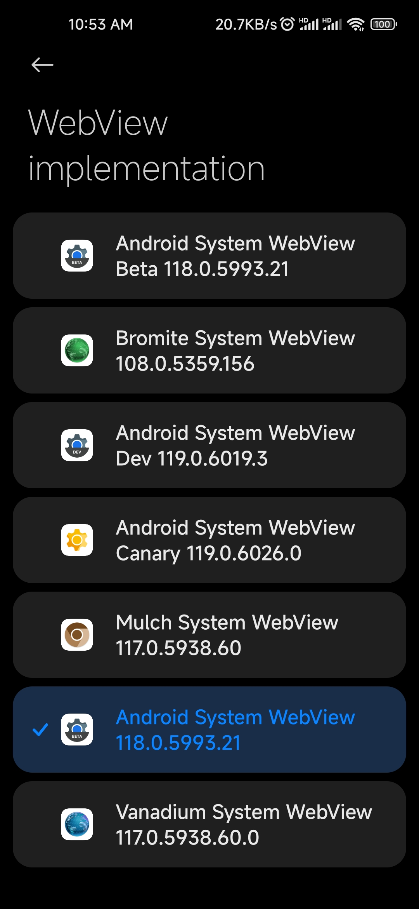

# AnyWebView

Any WebView is OK!

### Feature

It tries to detect all system webviews and add them to the developer options -> WebView implementation list.

### Compatibility

Android 7.0 is the minimum: the WebView provider-selection mechanism this app hooks was introduced in Nougat, so there is nothing to hook on older releases.

Real-device reports for the latest release:

* Android 10 / 11 / 12 - community confirmed (Vector SR + AOSmium WebView), see [#32](https://github.com/neoblackxt/AnyWebView/issues/32)
* Android 16 - developer tested
* Android 7-9, 13-15, 17 - expected to work (the hooked internals have been stable since Android 7), but not yet reported; both success and failure reports are welcome

### Usage

Android Framework should be selected in LSPosed.

A webview app must be installed for all users (or in all spaces, so-called Dual app, Second space, etc.) to be selectable. Maybe deleting redundant users is alternative.
adb command:

Enable "[redundant packages](https://chromium.googlesource.com/chromium/src/+/HEAD/android_webview/docs/quick-start.md#valid-package-is-not-installed_enabled-for-all-users)" (Maybe it won't work, but that's OK.):

`adb shell cmd webviewupdate enable-redundant-packages`

Get USER_ID list:

`adb shell pm list users`

Each user entry is as follow: UserInfo{USER_ID:USERNAME:INT} , USER_ID 0 is the main user.

Install apk for specific USER_ID:

`adb install --user USER_ID PATH/TO/APK/ON/COMPUTER`

or

`adb shell pm install-existing --user USER_ID PACKAGE.NAME.OF.APK` (for apks already installed for one user)

or

`adb push PATH/TO/APK/ON/COMPUTER PATH/TO/APK/ON/PHONE` (copy an apk file to phone from computer)

`adb shell pm install --user USER_ID PATH/TO/APK/ON/PHONE`

Delete a user (NOT RECOMENDED, be careful, you may lose important data):

`adb shell pm remove-user USER_ID`

All the `adb shell pm ...` commands above can be run in an Android terminal simulator(root access granted) as `pm ...`

Reboot to take effect.

### FAQ

Can I set Chrome as the system webview implementation?

Only supported on Android 8-9, not supported on Android 10+. It is Google's policy that Google Chrome app is no longer the WebView provider in Android 10. Even though it is listed in the WebView implementation, it does not work on Android 10+. Related discussion: [AnyWebView#12](https://github.com/neoblackxt/AnyWebView/issues/12#issuecomment-1644258502)

Is Bromite/Mulch/Vanadium etc. system webview supported?

Yes.

Does the WebView need to be installed as a system app?

No — a normally installed WebView APK is enough. Stock Android treats being a system app merely as a signature-check bypass, not a requirement, and AnyWebView registers each provider with its own signature so it passes validation either way.

Does this still work on Android 17?

It should, in theory. The internal interfaces behind this are unchanged on the AOSP master branch (Android 17) and have been stable since Android 7 — but this is theoretical analysis only, not tested on real hardware. Details: [Discussion #31](https://github.com/neoblackxt/AnyWebView/discussions/31)

### Learn More (For Developers)

[WebView quick start](https://chromium.googlesource.com/chromium/src/+/HEAD/android_webview/docs/quick-start.md)

[WebView for AOSP system integrators](https://chromium.googlesource.com/chromium/src/+/HEAD/android_webview/docs/aosp-system-integration.md)

[WebView Architecture](https://chromium.googlesource.com/chromium/src/+/HEAD/android_webview/docs/architecture.md)

[Installing SystemWebView](https://github.com/bromite/bromite/wiki/Installing-SystemWebView)

[android_webview/nonembedded](https://chromium.googlesource.com/chromium/src/+/HEAD/android_webview/nonembedded/)

[WebView Providers](https://chromium.googlesource.com/chromium/src/+/HEAD/android_webview/docs/webview-providers.md)

[WebViewFactory.java](https://android.googlesource.com/platform/frameworks/base/+/master/core/java/android/webkit/WebViewFactory.java)

